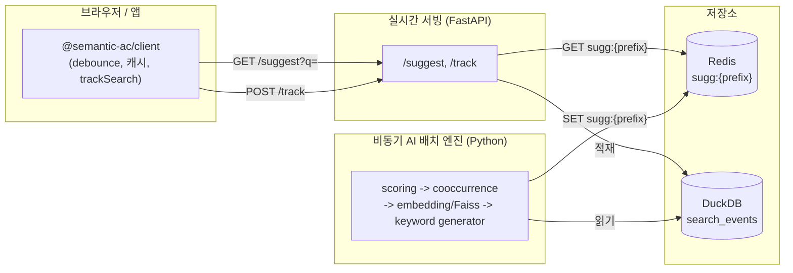
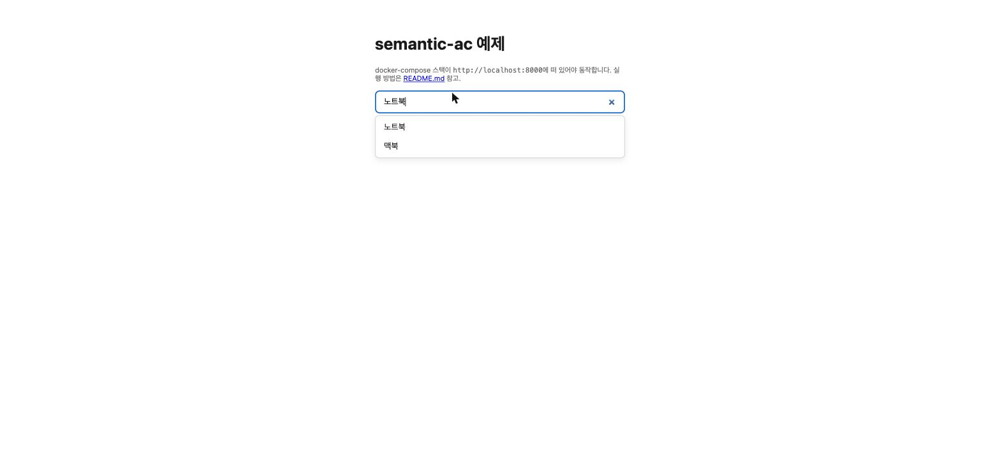
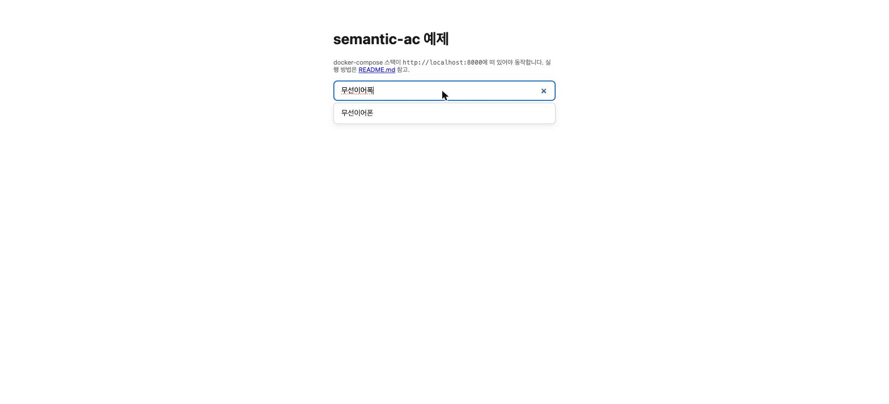

# semantic-ac

[](LICENSE)

> GPU 없이도 오타 교정과 문맥 기반 검색어 자동완성을 어떤 서비스에도 붙일 수 있는
> 오픈소스 셀프호스팅 툴킷

## 왜 필요한가

기존 Trie 기반 검색어 자동완성은 입력이 정확히 일치해야만 동작해 오타나 문맥적
유의어(예: "노트북" 입력 시 "맥북" 추천)를 처리하지 못합니다. 그렇다고 실시간
검색창에 LLM을 직접 붙이면 클라이언트 부담, GPU 비용, 응답 지연이 커져 실사용이
어렵습니다.

semantic-ac는 추천 사전을 오프라인 배치에서 sLLM과 임베딩으로 미리 컴파일해두고,
실시간 서빙은 Redis 캐시로 처리하는 방식으로 이 문제를 해결합니다. 무거운 연산은
전부 배치 쪽으로 밀어내고, 서빙 경로는 `GET`/`SET` 수준의 단순한 Redis 조회만
남깁니다.

## 아키텍처



| 레이어 | 패키지 | 역할 |
|---|---|---|
| Client SDK | [`@semantic-ac/client`](packages/client) (TypeScript) | debounce 제어, 세션 내 로컬 캐싱, 검색 이벤트 트래킹 |
| 실시간 서빙 API | [`search-server`](packages/server) (FastAPI + Redis) | 자동완성 O(1) 서빙, 검색 로그 수집(DuckDB) |
| 비동기 AI 배치 엔진 | [`ai-engine`](packages/ai-engine) (Python) | 로그 스코어링, 세션 co-occurrence 기반 연관 검색어 학습, 임베딩 기반 유사어 매칭, sLLM 기반 오타/문맥 사전 컴파일 |

세 컴포넌트는 [`docs/CONTRACT.md`](docs/CONTRACT.md)에 정의된 API 스키마와 Redis 키
포맷만으로 통신하므로, 서로 독립적으로 교체하거나 배포할 수 있습니다.

## 빠른 시작

### 준비물

- Docker / Docker Compose
- (SDK를 직접 빌드하거나 수정하려는 경우) Node.js 18+, [pnpm](https://pnpm.io)
- (Python 패키지를 직접 실행/수정하려는 경우) [uv](https://docs.astral.sh/uv/)

### 전체 스택 실행

```bash
docker compose up -d --build --wait
```

- `redis`, `search-server`(FastAPI, `:8000`), `ai-worker`(배치) 세 서비스가 뜹니다.
- `ai-worker`는 기본적으로 `stub_components`의 placeholder 구현체(`HashingEmbeddingModel`,
  `NoopKeywordGenerator`)로 배치 파이프라인의 구조만 검증합니다(실제 추천 품질 없음).

동작 확인:

```bash
curl -X POST http://localhost:8000/track \
  -H 'Content-Type: application/json' \
  -d '{"prefix": "노트북", "selected": "가성비 노트북", "action": "final_search", "sessionId": "demo-session-1"}'

# ai-worker가 배치를 1회 이상 실행한 뒤
curl 'http://localhost:8000/suggest?q=노트북'
```

전체 트랙(SDK → API → Redis → 배치)을 자동으로 검증하는 E2E 스크립트:

```bash
./scripts/e2e.sh
```

### 데모 데이터로 바로 체험하기

빈 `search_events`로는 위 `curl` 예시처럼 이벤트를 하나씩 직접 쌓아야 연관 검색어를
볼 수 있습니다. 콜드 스타트 없이 co-occurrence("노트북" → "맥북")와 오타 교정
("무선이어폭" → "무선이어폰") 데모를 바로 보고 싶다면:

```bash
./scripts/seed-demo-data/seed.sh
docker compose restart ai-worker   # 배치 주기를 기다리지 않고 즉시 1회 실행

curl 'http://localhost:8000/suggest?q=노트북'
```

자세한 내용은 [`scripts/seed-demo-data/README.md`](scripts/seed-demo-data/README.md) 참고.
위 데이터를 주입한 뒤 [`examples/vanilla`](examples/vanilla)에서 실제로 입력하면:

| co-occurrence 연관 검색어 | 오타 교정 |
|---|---|
|  |  |
| "노트북" 입력 → 같은 세션에서 자주 함께 검색된 "맥북"이 함께 추천됨 | "무선이어폭"(오타) 입력 → 과거 로그가 학습한 정상 표기 "무선이어폰"으로 교정 |

### 실모델(E5/Qwen)로 전환하기

위 placeholder는 배치 구조만 검증할 뿐 실제 추천 품질(오타 교정, "노트북"→"맥북" 같은
연관어)은 만들어내지 않습니다. `docker-compose.yml`의 `ai-worker.environment`에서 아래
주석을 해제하면 이미지를 다시 빌드하지 않고도 실모델로 전환됩니다:

```yaml
EMBEDDING_PROVIDER: "e5"
KEYWORD_GENERATOR_PROVIDER: "qwen"
QWEN_MODEL_PATH: "/models/qwen2.5-1.5b-instruct-q4_k_m.gguf"
```

Qwen GGUF 파일은 용량이 커서(수 GB) 자동으로 받지 않으므로 미리 `./models`에
내려받아둬야 합니다:

```bash
pip install -U "huggingface_hub[cli]"
huggingface-cli download Qwen/Qwen2.5-1.5B-Instruct-GGUF \
  qwen2.5-1.5b-instruct-q4_k_m.gguf --local-dir ./models
docker compose up -d ai-worker   # env var만 바뀌었으므로 재빌드 불필요
```

E5 임베딩 모델은 첫 배치 실행 시 자동으로 다운로드/캐시됩니다(별도 준비 불필요).
다른 임베딩/GGUF 모델로 바꾸는 방법, env var 전체 목록, 생성 품질 검증 스크립트는
[`packages/ai-engine/README.md`](packages/ai-engine/README.md#로드맵)를 참고하세요.

### 클라이언트 SDK 설치

```bash
pnpm add @semantic-ac/client
```

사용법은 [`packages/client/README.md`](packages/client/README.md)를 참고하세요. 기존
검색창에 실제로 연결하는 러너블 예제는 [`examples/vanilla`](examples/vanilla)에
있습니다.

## 내 서비스에 적용하기

### 1. 배포

docker-compose 세 서비스(`redis`, `search-server`, `ai-worker`)를 자사 인프라에
띄웁니다. 최소한 아래 두 환경 변수는 반드시 실서비스 값으로 바꿔야 합니다
(`docker-compose.yml` 참고).

| 환경 변수 | 데모 기본값 | 실서비스에서 해야 할 일 |
|---|---|---|
| `ALLOWED_ORIGINS` | `*` | 자사 프런트엔드 도메인으로 좁히기 (콤마로 여러 개 가능) |
| `DUCKDB_PATH` | 컨테이너 내부 임시 경로 | 영구 볼륨에 마운트 (재시작 시 검색 로그가 사라지지 않도록) |

`search-server`/`ai-engine`의 나머지 환경 변수는 각 패키지 README를 참고하세요.

### 2. 프런트엔드에 SDK 연결

기존 검색 input에 debounce/캐싱/트래킹까지 포함해 실제로 연결하는 전체 흐름은
[`examples/vanilla`](examples/vanilla)에서 바로 실행해볼 수 있습니다. API 상세는
[`packages/client/README.md`](packages/client/README.md) 참고.

**주의:** `SemanticAutocompleteClient` 인스턴스는 생성 시 세션 ID를 1회 발급해
이후 모든 `trackSearch()` 호출에 실어 보냅니다(연관 검색어 학습의 상관키, 위
[콜드 스타트](#3-콜드-스타트-이해하기) 참고). 검색할 때마다, 혹은 리렌더링마다
새 인스턴스를 만들면 세션이 매번 끊겨 co-occurrence 학습이 되지 않으니, 한 브라우징
세션 동안은 인스턴스 하나를 재사용하세요.

### 3. 콜드 스타트 이해하기

배포 직후에는 아직 검색 로그가 없으므로 `ai-worker`가 생성한 추천 사전도 비어
있습니다. 이 상태에서 `suggest()`는 에러가 아니라 **빈 배열**을 반환합니다 — 프런트
엔드는 이를 "추천 없음"으로 정상 처리해야 합니다(드롭다운을 숨기면 됩니다). 실제
사용자가 검색을 몇 번 하고(→ `trackSearch` 로그 누적), 배치가 최소 1회 실행된
뒤부터(기본 주기 60초, `BATCH_INTERVAL_SECONDS`) 추천이 채워지기 시작합니다.

같은 prefix 재검색 기반 추천(빈도+최신성)은 로그가 조금만 쌓여도 채워지지만,
"노트북"→"맥북"처럼 문자열이 겹치지 않는 진짜 연관 검색어는 **같은 세션에서 두
검색어 이상이 함께 selected된 세션**이 쌓여야 나타나기 시작합니다(session
co-occurrence, [`packages/ai-engine/README.md`](packages/ai-engine/README.md) 참고).
따라서 초기에는 같은 prefix 완성어 위주로만 보이다가, 트래픽이 쌓일수록 연관
검색어가 점차 채워지는 것이 정상입니다.

### 4. 운영 체크리스트

- **HTTPS**: 이 저장소는 평문 HTTP만 서빙합니다. nginx/Caddy 등 리버스 프록시를
  앞단에 두고 TLS를 종단하세요.
- **CORS**: `ALLOWED_ORIGINS`를 자사 도메인으로 제한했는지 다시 확인하세요.
- **배치 리소스**: `docker-compose.yml`의 `ai-worker` `deploy.resources.limits`와
  `BATCH_INTERVAL_SECONDS`를 트래픽 규모에 맞게 조정하세요
  ([`packages/ai-engine/README.md`](packages/ai-engine/README.md) 참고).
- **독립성**: `redis`/DuckDB 볼륨은 이 툴킷 전용입니다. 메인 서비스의 DB나 검색
  엔진 구조를 바꿀 필요가 없습니다.
- **추천어 품질**: 불용어/길이/숫자·특수문자만 제거는 기본 내장돼 있지만,
  욕설/스팸 차단 단어는 코드에 하드코딩하지 않으므로 `SUGGESTION_BLOCKLIST_PATH`로
  자사 상황에 맞는 목록을 채워야 합니다
  ([`packages/ai-engine/README.md`](packages/ai-engine/README.md#후보-정제와-llm-가드레일) 참고).

## 저장소 구조

```
.
├── docker-compose.yml       redis / search-server / ai-worker 오케스트레이션
├── docs/CONTRACT.md         트랙 간 공유 API/Redis 계약
├── examples/vanilla/        기존 input에 SDK를 붙이는 러너블 예제
├── packages/
│   ├── client/              @semantic-ac/client (TypeScript SDK)
│   ├── server/               search-server (FastAPI)
│   └── ai-engine/           ai-engine (Python 배치 파이프라인)
├── scripts/e2e.sh           전체 스택 E2E 실행 스크립트
└── tests/e2e/run.mjs        E2E 검증 로직
```

## 개발

이 저장소는 pnpm 워크스페이스(TypeScript)와 두 개의 독립적인 uv 프로젝트(Python)로
구성되어 있습니다. 각 패키지는 자체 테스트 스위트를 갖습니다.

```bash
# TypeScript (client SDK)
pnpm install
pnpm -r test

# FastAPI 서버
cd packages/server && uv sync && uv run pytest

# AI 배치 엔진
cd packages/ai-engine && uv sync --group dev && uv run pytest
```

기여 방법은 [`CONTRIBUTING.md`](CONTRIBUTING.md)를 참고하세요.

## License

[MIT](LICENSE) © 2026 yogurt-c
