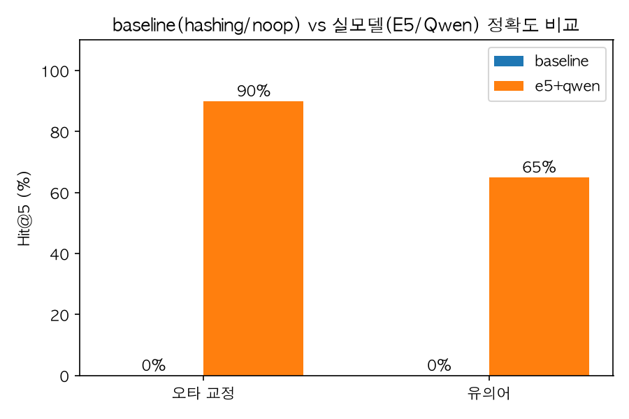

# ai-engine

비동기 AI 배치 엔진. [`search-server`](../server)가 DuckDB `search_events` 테이블에
적재한 검색 로그를 읽어, 빈도+최신성 기반으로 키워드를 스코어링하고, 세션
co-occurrence로 실제 사용자 행동에서 연관 검색어를 학습하고, 임베딩/Faiss로
의미적 연관 키워드를 찾아, 오타/문맥 연관 키워드를 보강한 뒤 Redis에 자동완성
사전(`sugg:{prefix}`)을 원자적으로 기록하는 배치 파이프라인이다. 상시 실행 서버가
아니라 주기 실행되는 원샷 작업으로 설계되어 있다 (스키마는
[`../../docs/CONTRACT.md`](../../docs/CONTRACT.md) 참고).

## 추천 검색어가 만들어지는 방식

같은 prefix 안에서의 빈도/최신성만으로는 "노트북"을 검색하는 사람에게 "맥북"
같이 문자열이 겹치지 않는 진짜 연관 검색어를 추천할 수 없다. 이를 위해
`cooccurrence.py`가 `session_id`로 묶인 검색 로그에서 같은 세션에 함께
selected된 키워드 쌍을 지수 감쇠 가중치로 누적해 학습한다 — 최근에, 더 많은
세션에서 함께 검색될수록 연관 점수가 강해지고, 오래된 관계는 자연히 약해진다.
`session_id`는 클라이언트 SDK가 인스턴스 생성 시 1회 발급해 모든 `trackSearch()`
호출에 실어 보낸다 (`docs/CONTRACT.md` 섹션 2).

```
score(A, B) = Σ_세션(A,B 함께 selected) 0.5 ^ (age_hours / half_life_hours)
```

`pipeline.run_batch`는 prefix별 상위 완성어(`score_keywords`)를 seed로 삼아 이
co-occurrence 그래프에서 연관 키워드를 끌어온 뒤, 임베딩/Faiss 의미 유사도와
LLM 생성 오타 후보를 함께 병합한다.

### 예시로 보는 최종 결과

"노트북"과 "맥북"이 같은 세션에서 함께 selected된 로그가 충분히 쌓였다고 하면,
prefix `"노"`에 대해 `sugg:노`가 다음과 같은 순서로 채워진다:

```json
["노트북", "노트북 추천", "맥북", "labtop"]
```

각 항목이 어느 레이어에서 온 것인지 순서대로:

1. `"노트북"`, `"노트북 추천"` — **prefix 랭킹**(`score_keywords`): `"노"`로
   시작한 사람들이 과거에 자주/최근에 selected한 완성어. 로그가 조금만 쌓여도
   채워진다.
2. `"맥북"` — **co-occurrence**(`cooccurrence.py`): `"노트북"`과 같은 세션에서
   자주 함께 selected된 키워드. 문자열은 전혀 안 겹치지만 실제 행동 데이터로
   연결된 것이라, 세션 로그가 어느 정도 쌓여야 나타나기 시작한다.
3. `"labtop"` — **KeywordGenerator**(LLM): Faiss로 찾은 의미적 인접 키워드를
   context로 받아 생성한 오타 후보. 현재 기본값인 `NoopKeywordGenerator`는
   항상 빈 값을 반환하므로 실모델을 연결해야 실제로 채워진다([로드맵](#로드맵)).

`_merge_unique`가 이 순서(prefix 랭킹 → co-occurrence → LLM 생성)대로 병합하며
완전 일치 중복을 제거하고, `clean_candidates`(`candidate_filters.py`)가 정규화
기준 유사 중복/불용어/길이 상하한/숫자·특수문자만/블록리스트를 한 번 더 걸러낸
뒤, 최종적으로 `top_n`개(기본 10개, `SUGGESTION_TOP_N`로 조정)로 자른다.

## 후보 정제와 LLM 가드레일

로그 기반 레이어(prefix 랭킹, co-occurrence)는 "실제로 검색된 적 있는" 값만
다루지만, LLM 생성기는 존재하지 않던 문자열을 새로 만들어낸다. 이 차이 때문에
`pipeline.run_batch`는 주입받은 `KeywordGenerator`를 항상
[`GuardedKeywordGenerator`](src/ai_engine/guarded_keyword_generator.py)로 감싸
사용한다 — `NoopKeywordGenerator`를 실모델로 교체해도 아래 방어선은 코드를
고치지 않아도 그대로 유지된다:

1. **안전 폴백** — 모델 호출이 예외를 던지거나 `list[str]`이 아닌 값을
   반환하면 빈 리스트로 대체한다. 부분 오염된 값은 절대 통과시키지 않는다.
2. **시드 근접성 검사** — 생성된 후보가 prefix/context와 편집거리 기준으로
   너무 무관하면(`difflib.SequenceMatcher` 비율 < `similarity_threshold`,
   기본 0.3) 환각으로 간주해 폐기한다.
3. **공통 정제 필터 재적용** — 살아남은 후보도 다른 레이어와 동일한
   `clean_candidates`를 한 번 더 통과해야 한다.

병합 이후 `clean_candidates`가 전체 목록에 적용하는 규칙:

- **길이**: `SUGGESTION_MIN_LEN` ~ `SUGGESTION_MAX_LEN` 범위 밖은 제거
- **숫자/특수문자만**: 전부 숫자거나 한글·영문·숫자를 하나도 포함하지 않으면 제거
- **불용어**: `candidate_filters.DEFAULT_STOPWORDS`(조사성 채움말 소량 내장)
- **블록리스트**: `SUGGESTION_BLOCKLIST_PATH`가 가리키는 파일(줄 단위 단어,
  `#` 주석 지원)에 있는 단어와 casefold 일치하면 제거 — 욕설/스팸 단어를
  코드에 하드코딩하지 않고 운영자가 직접 채우도록 분리했다
- **정규화 dedup**: `_merge_unique`는 완전 일치만 dedup하므로, 대소문자/좌우
  공백만 다른 유사 중복은 여기서 casefold 키로 한 번 더 제거

빈도 기반 레이어(`score_keywords`, `build_cooccurrence_scores`)에는
`SUGGESTION_MIN_COUNT`로 최소 등장 횟수 threshold를 별도로 둔다 — 1회만
등장한 오타성 `selected` 값이 곧바로 추천 후보가 되는 것을 막는다.
LLM 생성기 레이어는 최종 `top_n` 중 `SUGGESTION_GENERATED_MAX_SHARE`
(기본 30%)를 넘지 못하도록 별도로 캡을 둔다 — 한 레이어가 결과를 도배하는
것을 막는다.

## 기술 스택

- 임베딩 모델: `intfloat/multilingual-e5-small` (다른 sentence-transformers 모델로 교체 가능 — [로드맵](#로드맵) 참고)
- Vector DB: Faiss (라이브러리 내장, 별도 서버 프로세스 없음)
- sLLM: Llama.cpp + Qwen2.5-1.5B-GGUF (4-bit 양자화, 다른 GGUF 모델로 교체 가능) — 연결 방법은 아래 [로드맵](#로드맵) 참고

## Structure

```
src/ai_engine/
  events.py             SearchEvent (search_events 레코드 1건, session_id 포함)
  db_reader.py           DuckDB search_events 테이블 읽기 (read-only)
  scoring.py             빈도+최신성 스코어링 순수 함수 (DB 비의존)
  cooccurrence.py        세션 co-occurrence 기반 연관 검색어 학습 (DB 비의존)
  embeddings.py          EmbeddingModel Protocol + E5SmallEmbeddingModel(실제 통합 지점)
  vector_index.py        Faiss 인덱스 빌드 / 원자적 저장(os.replace) / 최근접 검색
  keyword_generator.py   KeywordGenerator Protocol (오타/문맥 연관 키워드 생성)
  qwen_keyword_generator.py  Llama.cpp + Qwen2.5-1.5B-GGUF 실제 통합 지점(KeywordGenerator)
  guarded_keyword_generator.py  KeywordGenerator 래퍼 — 예외/형식 오류/환각 후보 방어
  candidate_filters.py   불용어/길이/숫자·특수문자만/블록리스트 정제 + 정규화 dedup
  redis_writer.py        sugg:{prefix} 원자적 SET (docs/CONTRACT.md 섹션 3)
  pipeline.py            스코어링 -> co-occurrence -> 임베딩/Faiss -> KeywordGenerator -> 정제 -> Redis 조립
  stub_components.py     HashingEmbeddingModel/NoopKeywordGenerator — 실모델 없이도
                         docker-compose가 즉시 뜨도록 하는 기본값 placeholder (실제
                         추천 품질 없음, EMBEDDING_PROVIDER/KEYWORD_GENERATOR_PROVIDER로 전환)
  runner.py              env var(REDIS_URL/DUCKDB_PATH/INDEX_PATH/BATCH_INTERVAL_SECONDS)
                         기반 배치 실행 진입점. `--once`(1회 실행, 예외 전파) /
                         기본(반복 실행, 예외 로깅 후 다음 주기 재시도) 두 모드 지원.
                         build_embedding_model()/build_keyword_generator()가
                         EMBEDDING_PROVIDER/KEYWORD_GENERATOR_PROVIDER로 stub↔실모델을 선택
scripts/
  eval_keyword_generator.py  설정된 KeywordGenerator의 생성 품질을
                         tests/fixtures/typo_synonym_pairs.json으로 정성 검수하는
                         수동 스크립트 (pytest 게이트 밖, 실모델 전제 — "생성 품질 평가" 참고)
  eval_pipeline_quality.py  run_batch 전체 파이프라인을 baseline vs 실모델(E5/Qwen)로
                         비교해 Hit@5 막대그래프를 남기는 수동 스크립트 (pytest 게이트
                         밖, 실모델+matplotlib 전제 — "파이프라인 품질 벤치마크" 참고)
tests/
  conftest.py            FakeEmbeddingModel, FakeKeywordGenerator 등 테스트 더블
  fixtures/typo_synonym_pairs.json   한국어 오타/유의어 평가 샘플 15개
  fixtures/pipeline_quality_benchmark.json  파이프라인 벤치마크용 오타/유의어 샘플 40개
```

## 실행

```bash
uv sync --group dev
uv run pytest          # 전체 테스트 + 커버리지(80%+ 게이트)
```

배치를 직접 돌리려면 `ai_engine.pipeline.run_batch()`에 구성요소를 주입한다:

```python
from ai_engine.db_reader import fetch_search_events
from ai_engine.pipeline import run_batch

events = fetch_search_events("path/to/search_events.duckdb")
run_batch(events, embedding_model, keyword_generator, redis_client, "path/to/index.faiss")
```

docker-compose 환경에서는 `runner.py`의 `build_embedding_model()`/
`build_keyword_generator()`가 `EMBEDDING_PROVIDER`/`KEYWORD_GENERATOR_PROVIDER`
env var로 `stub_components`의 placeholder(`HashingEmbeddingModel`,
`NoopKeywordGenerator`, 기본값)와 실모델(`E5SmallEmbeddingModel`,
`QwenKeywordGenerator`) 사이를 전환한다. 실모델 연결 방법은 아래 [로드맵](#로드맵)을
참고한다.

## 환경 변수

`runner.py`(배치 실행 진입점)가 읽는 환경 변수. docker-compose에서는 `ai-worker`
서비스의 `environment:`에 설정한다(`docker-compose.yml` 참고). 코드를 고치지
않고도 추천 생성 방식을 자사 트래픽에 맞게 조정할 수 있다.

| 변수 | 기본값 | 설명 |
|---|---|---|
| `REDIS_URL` | `redis://localhost:6379/0` | 추천 결과를 쓸 Redis |
| `DUCKDB_PATH` | `data/search_events.duckdb` | 읽어올 검색 로그 DB(`search-server`와 같은 파일 공유) |
| `INDEX_PATH` | `data/index.faiss` | Faiss 인덱스 파일 경로 |
| `BATCH_INTERVAL_SECONDS` | `60` | 배치 반복 주기(초). `--once`와 함께 쓰지 않음 |
| `SUGGESTION_TOP_N` | `10` | prefix당 최종 추천 개수 |
| `FAISS_CONTEXT_SIZE` | `5` | `KeywordGenerator`에 넘길 Faiss 최근접 키워드 개수 |
| `COOCCURRENCE_HALF_LIFE_HOURS` | `168`(1주) | 연관 검색어(co-occurrence) 점수의 감쇠 반감기. 짧게 하면 최신 트렌드에 더 민감해지지만 데이터가 적을 때는 관계가 빨리 사라진다 |
| `COOCCURRENCE_SEED_SIZE` | `3` | prefix당 co-occurrence 조회에 seed로 쓸 상위 완성어 개수 |
| `SUGGESTION_MIN_COUNT` | `1` | prefix 랭킹/co-occurrence 후보의 최소 등장 횟수(raw count). 1은 필터링 없음과 동일 |
| `SUGGESTION_MIN_LEN` | `2` | 추천 후보 문자열의 최소 길이 |
| `SUGGESTION_MAX_LEN` | `50` | 추천 후보 문자열의 최대 길이 |
| `SUGGESTION_BLOCKLIST_PATH` | (미설정) | 욕설/스팸 차단 단어 목록 파일 경로(줄 단위, `#` 주석 지원). 미설정 시 블록리스트 없음 |
| `SUGGESTION_GENERATED_MAX_SHARE` | `0.3` | 최종 `top_n` 중 LLM 생성기 레이어가 차지할 수 있는 최대 비중(0~1) |
| `EMBEDDING_PROVIDER` | `hashing` | `hashing`(placeholder) \| `e5`(`E5SmallEmbeddingModel` 실모델) |
| `E5_MODEL_NAME` | `intfloat/multilingual-e5-small` | `e5` provider일 때 로드할 sentence-transformers 모델 이름. 다른 다국어 임베딩 모델로 교체 가능 |
| `KEYWORD_GENERATOR_PROVIDER` | `noop` | `noop`(placeholder) \| `qwen`(`QwenKeywordGenerator` 실모델) |
| `QWEN_MODEL_PATH` | (미설정) | `qwen` provider일 때 필수. GGUF 파일 경로. 다른 GGUF 모델(다른 크기/모델군)로 교체 가능 |
| `QWEN_N_CTX` | `512` | llama.cpp context 크기 |
| `QWEN_MAX_TOKENS` | `64` | 생성 최대 토큰 수 |

## 로드맵

`EmbeddingModel`/`KeywordGenerator`는 둘 다 Protocol로 정의된 통합 지점이라,
`runner.py`가 env var만으로 아래 구현체와 stub 사이를 전환한다 — **이미지를
다시 빌드할 필요 없이** 값만 바꾸면 된다. 아래는 실제로 그대로 복사해서 실행할 수
있는 절차다.

### 임베딩 모델 연결/교체 (E5 → 원하는 sentence-transformers 모델)

**1. 로컬에서 바로 써보기** (docker-compose 이미지는 `--extra models`를 항상
포함하므로 이 설치는 로컬 직접 실행 시에만 필요):

```bash
uv sync --extra models
export EMBEDDING_PROVIDER=e5
uv run python -m ai_engine.runner --once
```

첫 실행 시 `sentence-transformers`가 `intfloat/multilingual-e5-small`(약 470MB)을
Hugging Face에서 받아 `~/.cache/huggingface`에 캐시한다(두 번째 실행부터는 네트워크
호출 없음).

**2. docker-compose에서 켜기**: `docker-compose.yml`의 `ai-worker.environment`에서
`EMBEDDING_PROVIDER: "e5"` 주석을 해제한 뒤:

```bash
docker compose up -d ai-worker   # env var만 바뀌었으므로 재빌드 불필요
```

**3. 다른 모델로 바꾸기**: 코드 수정도 재빌드도 필요 없다, `E5_MODEL_NAME`만 바꾸면
된다. 예를 들어 더 큰(정확도↑, 속도/메모리↓) 버전으로:

```bash
export E5_MODEL_NAME=intfloat/multilingual-e5-base
uv run python -m ai_engine.runner --once
```

sentence-transformers Hub에 있는 어떤 모델 이름이든 넣을 수 있지만, `e5` 계열이 아닌
모델(예: `BAAI/bge-*`)로 완전히 바꾸는 경우 문서(모델 카드)의 프리픽스 규칙이
`intfloat/multilingual-e5-*`와 다를 수 있으니 `embeddings.py`의
`E5_QUERY_PREFIX`/`E5_PASSAGE_PREFIX` 상수도 함께 맞춰야 한다.

### 생성 모델(Qwen GGUF) 연결/교체

**1. GGUF 파일 다운로드** (자동 다운로드는 하지 않는다 — 수 GB라 명시적으로 받게
해둔 것):

```bash
pip install -U "huggingface_hub[cli]"
huggingface-cli download Qwen/Qwen2.5-1.5B-Instruct-GGUF \
  qwen2.5-1.5b-instruct-q4_k_m.gguf --local-dir ./models
```

**2. 로컬에서 바로 써보기**:

```bash
uv sync --extra models
export KEYWORD_GENERATOR_PROVIDER=qwen
export QWEN_MODEL_PATH=./models/qwen2.5-1.5b-instruct-q4_k_m.gguf
uv run python -m ai_engine.runner --once
```

**3. docker-compose에서 켜기**: 위에서 받은 GGUF가 `./models`에 있으면 컨테이너의
`/models`에 그대로 마운트된다. `docker-compose.yml`의 `ai-worker.environment`에서
`KEYWORD_GENERATOR_PROVIDER`/`QWEN_MODEL_PATH` 주석을 해제(경로는
`/models/qwen2.5-1.5b-instruct-q4_k_m.gguf`)한 뒤:

```bash
docker compose up -d ai-worker   # env var만 바뀌었으므로 재빌드 불필요
```

**4. 다른 GGUF 모델로 바꾸기**: 같은 방식으로 원하는 GGUF를 받아 `./models`에 넣고
`QWEN_MODEL_PATH`만 그 파일로 가리키면 된다. 예를 들어 더 큰 Qwen으로:

```bash
huggingface-cli download Qwen/Qwen2.5-3B-Instruct-GGUF \
  qwen2.5-3b-instruct-q4_k_m.gguf --local-dir ./models
export QWEN_MODEL_PATH=./models/qwen2.5-3b-instruct-q4_k_m.gguf
```

`llama-cpp-python`은 GGUF 메타데이터로 모델 아키텍처를 자동 인식하므로 Qwen이 아닌
다른 모델 계열(Llama, Mistral 등)의 GGUF도 그대로 로드는 된다. 다만
`qwen_keyword_generator.py`의 프롬프트 문자열은 Qwen이 기대하는 형식으로 짜여 있어,
완전히 다른 모델 계열로 바꾸면 그 모델의 instruct 프롬프트 템플릿에 맞게 프롬프트를
조정해야 생성 품질이 유지된다 — 바꾼 뒤에는 항상 아래
["생성 품질 평가"](#생성-품질-평가) 스크립트로 확인할 것.

**5. 안전장치**: 자유 텍스트를 `split(",")`로 파싱하지만, `pipeline.run_batch`가 이
구현체를 자동으로 `GuardedKeywordGenerator`로 감싸므로(위
["후보 정제와 LLM 가드레일"](#후보-정제와-llm-가드레일) 참고), 파싱 실패나 모델의
malformed 응답이 배치를 죽이거나 오염된 값을 그대로 노출시키지는 않는다. 다만
가능하다면 `llama-cpp-python`의 grammar/JSON 모드로 구조화된 출력을 받도록 프롬프트를
개선하는 쪽이 `split(",")` 파싱보다 안전하다 — 특히 `context`에 사용자가 입력한
원문이 그대로 들어가므로, 프롬프트 인젝션을 피하려면 `context`를 지시문이 아니라
순수 참고 데이터로만 취급하는 프롬프트 구조를 유지해야 한다(`QwenKeywordGenerator`는
이 원칙을 그대로 따른다).

### 생성 품질 평가

`scripts/eval_keyword_generator.py`가 설정된 `KeywordGenerator`(env var로 결정,
`GuardedKeywordGenerator`로 감싼 실제 production 경로)를
`tests/fixtures/typo_synonym_pairs.json`(한국어 오타/유의어 샘플 15개)으로 돌려
항목별 pass/fail과 type(typo/synonym)별·전체 정확도를 출력한다. pytest 스위트/커버리지
게이트 밖에 있다 — 실모델 가중치가 전제이므로 CI에서 자동 실행하지 않는다.

```bash
uv sync --extra models
export KEYWORD_GENERATOR_PROVIDER=qwen
export QWEN_MODEL_PATH=/path/to/qwen2.5-1.5b-instruct-q4_k_m.gguf
uv run python scripts/eval_keyword_generator.py
```

fixture에는 Faiss 컨텍스트가 없어 빈 컨텍스트로 평가한다는 한계가 있다 — 실제
파이프라인에서는 `nearest_keywords()`가 찾은 의미적 인접 키워드가 context로 함께
들어가므로, 이 스크립트의 정확도는 실제 배치보다 다소 보수적으로 나올 수 있다. 이
한계를 메운 end-to-end 버전은 바로 아래 "파이프라인 품질 벤치마크" 참고.

### 파이프라인 품질 벤치마크

`scripts/eval_pipeline_quality.py`는 `KeywordGenerator` 하나만 보는 위 스크립트와
달리 `pipeline.run_batch()` 전체(scoring → co-occurrence → Faiss → KeywordGenerator
→ 정제)를 baseline(`hashing`/`noop` placeholder)과 실모델(`E5`/`Qwen`) 두 설정으로
각각 돌려 `tests/fixtures/pipeline_quality_benchmark.json`(오타 20개 + 유의어 20개,
총 40개)에 대한 Hit@5를 비교한다. 각 테스트 prefix는 콜드 스타트를 가정해 이벤트를
1건만 주입하므로(`selected=prefix` 자기 자신 — 정답을 미리 알려주지 않기 위함),
baseline은 구조적으로 0%에 가깝게 나온다.

```bash
uv sync --extra models
export QWEN_MODEL_PATH=/path/to/qwen2.5-1.5b-instruct-q4_k_m.gguf
uv run --with matplotlib python scripts/eval_pipeline_quality.py
```

macOS에서 `llama-cpp-python`과 `sentence-transformers`(torch)가 OpenMP 런타임을
중복 링크해 죽는 경우 `KMP_DUPLICATE_LIB_OK=TRUE`를 함께 export한다(공식 지원 방식은
아니지만 평가 스크립트 실행 한정으로는 안전한 우회다).

실측 결과(2026-08-05, 위 fixture 40개 기준):



| 설정 | 오타 교정 | 유의어 |
|---|---|---|
| baseline(`hashing`/`noop`) | 0% | 0% |
| 실모델(`e5`+`qwen`, q4_k_m) | 90% | 65% |

fixture가 40개 남짓의 수작업 표본이라 대표성에 한계가 있고(선정 편향 가능성), 이
숫자는 "일반적인 품질 보증"이 아니라 "log 기반 스코어링만으로는 원천적으로 처리
불가능한 오타/유의어를 실모델이 상당 부분 커버한다"는 것을 보여주는 재현 가능한
근거로 봐야 한다. 모델/파라미터를 바꿀 때마다 이 스크립트로 회귀 여부를 확인할 것.

### 저사양 환경 검증

`docker-compose.yml`의 `ai-worker` 서비스는 `deploy.resources.limits`로 CPU/메모리를
캡핑해두었다. 실모델(E5/Qwen)이 연결된 지금, 실제 저사양 vCPU/RAM 환경에서 해당
제한값으로 배치가 안정적으로 도는지 별도로 검증하는 것을 권장한다(`TODO.md` 참고).

## License

MIT © 2026 yogurt-c
